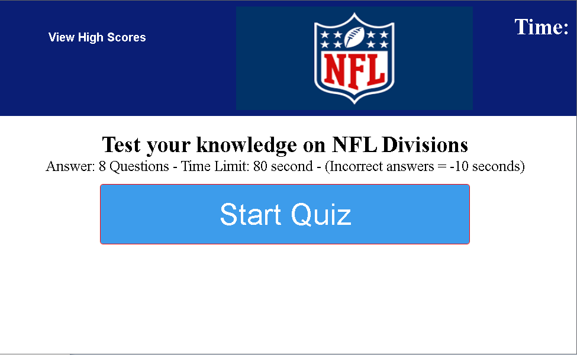
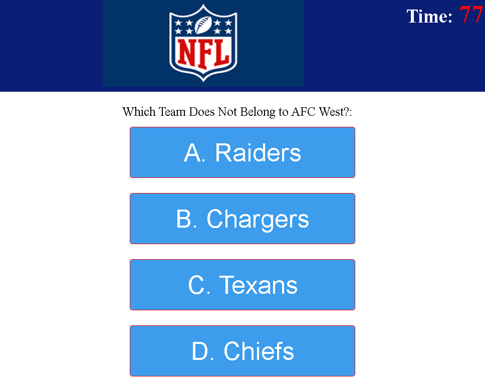
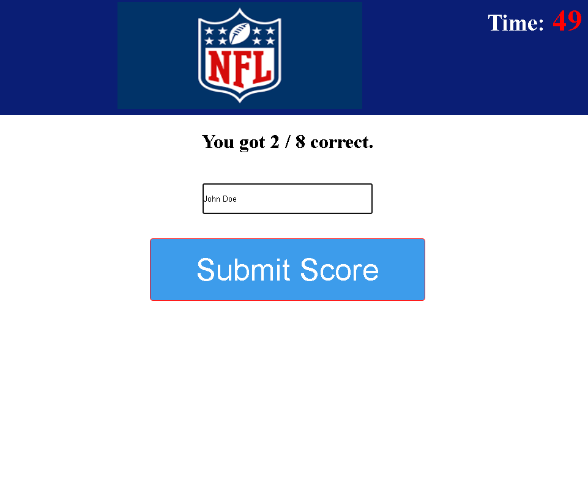
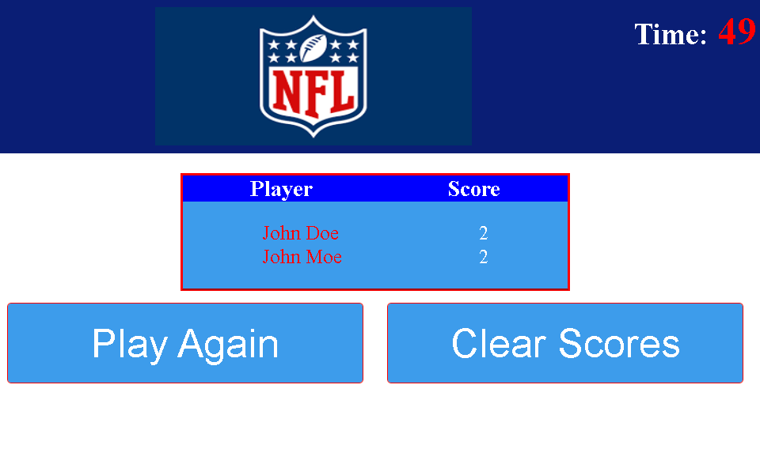

# Week-4-Challenge

## Web-APIs-Code-Quiz Challenge
* In our classes' Week 4 challenge we will prepare our journey to become a full stack web developer by completing a coding assessment. We will demonstrate our ability to create an assessment that includes multiple choice questions with interactive coding.

### Challenge Goals
 * Create an app that will run in the browser utilizing HTML and CSS dynamically powered by Javascript code.
 * App will be a timed quiz that will store results/scores of the quiz.
 * Once code base is properly functioning we will have to deploy the application to a live URL and Github URL which displays the site with a proper repository.

## Screenshot
Start Page:

Quiz Begins:

Quiz Results:

Store Scores:

## Status
* App has been created with HTML and CSS in browser powered by Javascript. 
* App provides quiz with an initial start page with a start button to generate quiz.
* Questions will be generated in multiple choice forms. Quiz has been given a time limit.
* Quiz will subtract time for every incorrect answer.
* Quiz will end when timer reaches 0.
* End of quiz will take us to a score page where players will input name and score to store data to track scores. 
* Completed all acceptance criteria and have deployed links:
    * Live link: https://louyoon89.github.io/Week-4-Challenge-Web-APIs-Code-Quiz/
    * Github link: https://github.com/louyoon89/Week-4-Challenge-Web-APIs-Code-Quiz
